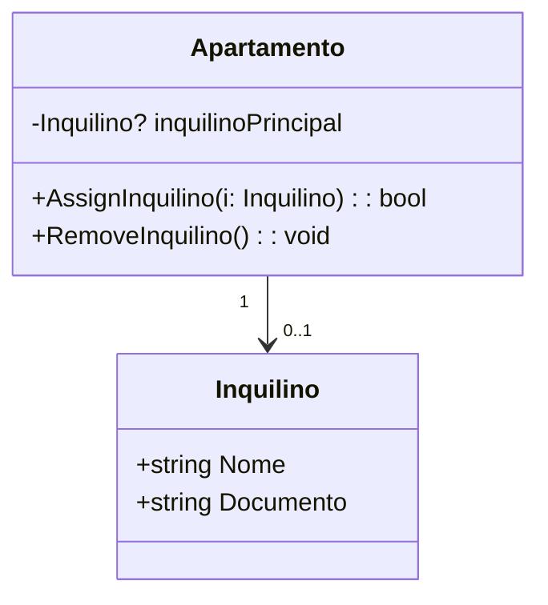

# Exemplo 08 – Apartamento e Inquilino Principal (0..1)

## 1. Cenário

Um **Apartamento** pode estar vazio ou ter um **Inquilino Principal** associado.  
Cada inquilino só pode ser principal em um único apartamento por vez.  
O vínculo deve ser controlado de forma explícita, permitindo a atribuição e a liberação do inquilino.

---

## 2. Invariantes de Domínio

1. Um **Apartamento** pode ter **0 ou 1 Inquilino Principal**.
2. Um **Inquilino** só pode ser o principal de um apartamento por vez.
3. Não é permitido sobrescrever silenciosamente um inquilino já associado.
4. Deve existir método explícito para **atribuir** (`AssignInquilino`) e **remover** (`RemoveInquilino`).
5. Um apartamento vazio deve ser representado por um inquilino nulo (`null`).

---

## 3. Decisões de Navegabilidade

- Navegabilidade mínima:
  - **Apartamento → Inquilino** (opcional, controlado por métodos de domínio).
- O **Inquilino** não mantém referência direta ao apartamento, evitando dependência cíclica.

---

## 4. Diagrama Mínimo (UML)

