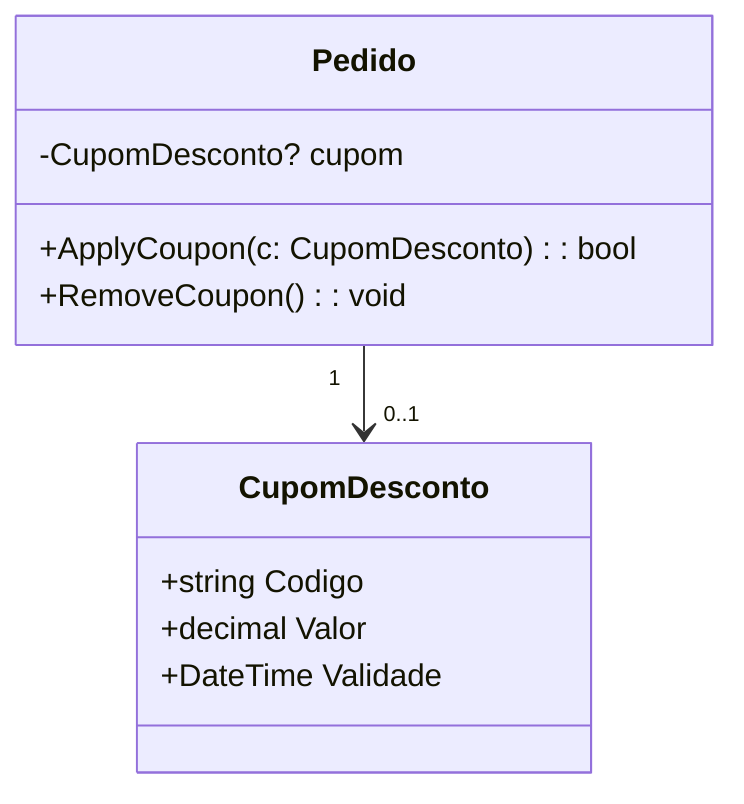

# Exemplo 07 – Pedido e Cupom de Desconto (0..1)

## 1. Cenário

Um **Pedido** pode ter um **Cupom de Desconto** aplicado, mas isso é opcional.  
Se aplicado, o cupom só pode estar vinculado a um único pedido e pode ser removido se o cliente decidir não utilizá-lo.

---

## 2. Invariantes de Domínio

1. Um **Pedido** pode ter **0 ou 1 Cupom de Desconto**.
2. Um **Cupom de Desconto** pode ser usado em apenas um pedido.
3. Não é permitido sobrescrever silenciosamente um cupom já associado.
4. Deve existir método explícito para aplicar (`ApplyCoupon`) e remover (`RemoveCoupon`) o cupom.
5. O cupom deve ser validado (ex.: não nulo, ativo, dentro da data de validade).

---

## 3. Decisões de Navegabilidade

- Navegabilidade mínima:
  - **Pedido → CupomDesconto** (opcional, controlado por métodos de domínio).
- O **Cupom de Desconto** não mantém referência ao pedido, evitando acoplamento desnecessário.

---

## 4. Diagrama Mínimo (UML)

