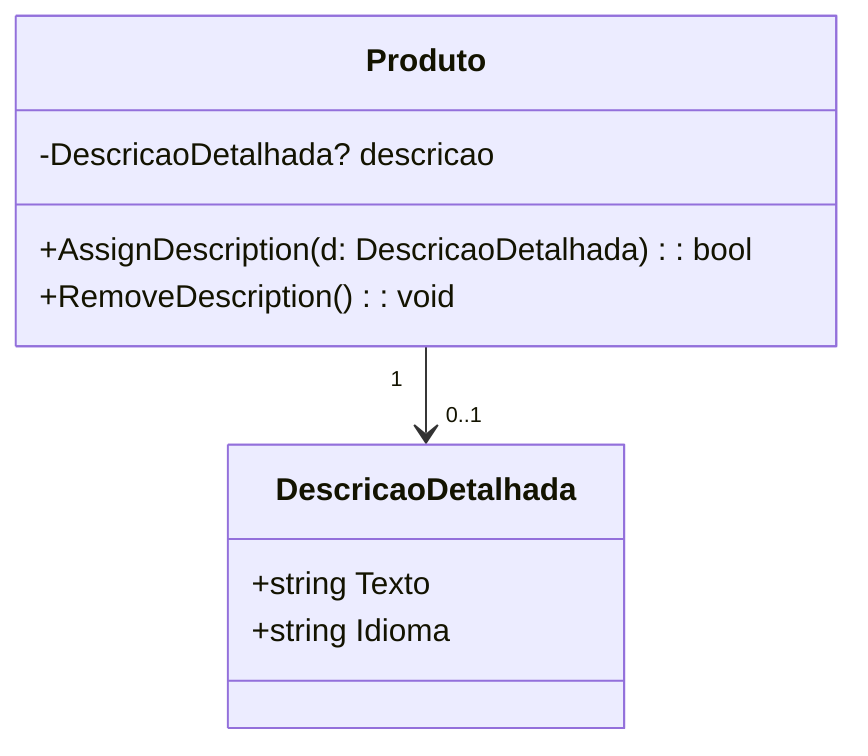

# Exemplo – Produto e Descrição Detalhada (0..1)

## 1. Cenário

Um **Produto** pode ter ou não uma **Descrição Detalhada**.  
Se a descrição existir, ela pertence exclusivamente àquele produto.  
É possível **adicionar** ou **remover** a descrição a qualquer momento, garantindo consistência do estado.

---

## 2. Invariantes de Domínio

1. Um **Produto** pode ter **0 ou 1 Descrição Detalhada**.
2. A **Descrição Detalhada**, se existente, pertence a apenas um produto.
3. Não é permitido sobrescrever uma descrição existente sem removê-la previamente.
4. Métodos de domínio explícitos devem ser usados para **adicionar** (`AssignDescription`) e **remover** (`RemoveDescription`).

---

## 3. Decisões de Navegabilidade

- Navegabilidade mínima:
  - **Produto → DescricaoDetalhada** (opcional, controlado por métodos de domínio).
- A **DescricaoDetalhada** não mantém referência mutável ao produto, evitando acoplamento desnecessário.

---

## 4. Diagrama Mínimo (UML)

